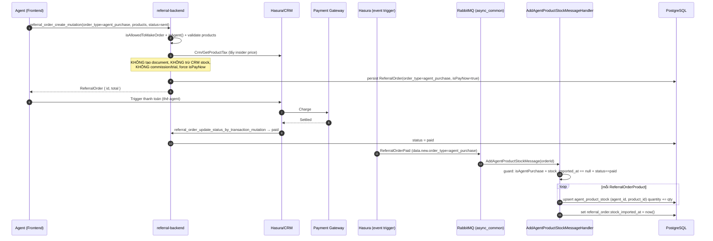

# Tech Spec — Agent Purchase Products & Nhập kho riêng của Agent

**Task:** D8-397
**Liên quan:** [01-requirement.md](../01-requirement.md) · [docs/domains/referral-order.md](../../../docs/domains/referral-order.md) · [docs/business/referral-order.md](../../../docs/business/referral-order.md)

---

## 1. Mục tiêu

Cho phép **Agent** tự mua sản phẩm để **nhập về kho riêng** của họ, thay vì bán cho khách. Khi đơn `agent_purchase` được thanh toán (`paid`), số lượng sản phẩm được cộng vào tồn kho riêng của agent ở bảng mới `agent_product_stock`.

Khác biệt cốt lõi so với đơn bán khách thường (`client_order`):

| Khía cạnh | Đơn thường (`client_order`) | Đơn `agent_purchase` |
|---|---|---|
| Người mua | Khách (Company / ClientInfo) | Chính Agent (`created_by`) |
| Client info / shipping address | Bắt buộc (XOR) | **Bỏ qua** |
| E-sign document (quote) | Có (`ReferralOrderDocument`) | **Bỏ** → Pay Now thẳng |
| Commission (`OrderCommission`) | Có | **Bỏ** |
| Trial / Referral | Tùy chọn | **Bỏ** |
| Trừ stock CRM trung tâm | Có (`Crm/ChangeProductStock`) | **Không** |
| Side-effect khi paid | PDF, email, commission, trial | **Cộng `agent_product_stock`** |

> Đơn `agent_purchase` **vẫn** đi qua payment gateway (thẻ của chính agent) để đạt `paid`; chỉ bỏ bước khách e-sign.

---

## 2. Quyết định thiết kế (chốt từ Q&A)

1. **`type` → `order_type`** trên `referral_order`: nullable string, `null` = đơn thường. Constant `TYPE_AGENT_PURCHASE='agent_purchase'`. Không backfill đơn cũ.
2. **`agent_product_stock`**: `agent_id` = `User.id` (UUID, ManyToOne User); `product_id` = CRM product id (string); unique `(agent_id, product_id)`.
3. **Cộng stock khi paid**: async qua `ReferralOrderPaidSubscriber` → `AddAgentProductStockMessage` → handler **upsert idempotent**.
4. **Không trừ** stock CRM trung tâm cho đơn `agent_purchase`.
5. **API**: thêm param `order_type` vào `referral_order_create_mutation` hiện có, resolver/service rẽ nhánh.
6. Chỉ user `isAgent()` được tạo đơn `agent_purchase`.

---

## 3. Database changes

### 3.1. Bảng mới `agent_product_stock`

| Cột | Kiểu | Ràng buộc | Ghi chú |
|---|---|---|---|
| `id` | uuid | PK | UUID v7 (`UuidV7Generator`) |
| `agent_id` | uuid | FK → `user(id)` `ON DELETE CASCADE`, NOT NULL | ManyToOne `User` |
| `product_id` | varchar | NOT NULL | CRM product id (string), **không** phải FK DB |
| `quantity` | integer | NOT NULL, default 0 | Tồn kho cộng dồn |
| `created_at` | timestamp(0) | nullable | Timestampable on create |
| `updated_at` | timestamp(0) | nullable | Timestampable on update |

**Index / constraint:**
- `UNIQUE (agent_id, product_id)` — tên `uniq_agent_product_stock_agent_product`. Bắt buộc để upsert (`ON CONFLICT`) hoạt động.
- Index `agent_id` (Doctrine tự tạo cho FK).

### 3.2. Cột mới trên `referral_order`

| Cột | Kiểu | Ràng buộc | Ghi chú |
|---|---|---|---|
| `order_type` | varchar | nullable | `null` = `client_order`; `'agent_purchase'` cho đơn agent |
| `stock_imported_at` | timestamp(0) | nullable | **Guard idempotency** — set khi đã cộng stock; re-process là no-op |

> `stock_imported_at` (nullable datetime) được chọn thay vì boolean `is_stock_imported` vì vừa làm cờ guard vừa ghi lại thời điểm import (informative hơn, hợp style datetime của repo).

### 3.3. Migration

- File `app/migrations/VersionYYYYMMDDHHMMSS.php`, viết tay theo chuẩn repo (không dùng `migrations:diff` raw — diff hay kéo theo drift ORM3/DBAL4).
- `up()`: `CREATE TABLE agent_product_stock (...)` + unique index; `ALTER TABLE referral_order ADD COLUMN order_type VARCHAR, ADD COLUMN stock_imported_at TIMESTAMP(0) WITHOUT TIME ZONE`.
- `down()`: drop cột + drop table.
- `ADD COLUMN` nullable là zero-downtime an toàn; không cần `CONCURRENTLY` cho ALTER (chỉ index lớn mới cần). Bảng mới rỗng nên không có risk.
- **Khuyến nghị:** chạy qua skill `db-migration-safety` / agent `migration-reviewer` trước khi merge.

### 3.4. Hasura metadata

- **Track** bảng mới `agent_product_stock` trong Hasura (để CRM/frontend query nếu cần).
- **Reload metadata** sau khi thêm cột `referral_order.order_type` để Hasura nhận field mới.
- Event-trigger `ReferralOrderPaid` hiện chỉ gửi payload `data.new`/`data.old` của `referral_order` — cần đảm bảo `order_type`, `stock_imported_at`, `created_by_id` nằm trong cột được gửi (mặc định Hasura gửi toàn bộ cột → OK).

---

## 4. Code changes

### 4.1. Entity

**`app/src/Entity/Stock/AgentProductStock.php`** (mới)
- `#[ORM\Entity(repositoryClass: AgentProductStockRepository::class)]`
- `#[ORM\Table(name: 'agent_product_stock')]`
- `#[ORM\UniqueConstraint(name: 'uniq_agent_product_stock_agent_product', columns: ['agent_id', 'product_id'])]`
- Fields: `id` (UUID v7 CUSTOM generator), `agent` (ManyToOne `User`, JoinColumn `onDelete: 'CASCADE'`, nullable false), `productId` (string), `quantity` (int), `createdAt`/`updatedAt` (Gedmo Timestampable).
- Getter/setter đầy đủ + `increaseQuantity(int $amount)` helper.

**`app/src/Entity/ReferralOrder/ReferralOrder.php`** (sửa)
```php
public const TYPE_CLIENT_ORDER   = 'client_order';
public const TYPE_AGENT_PURCHASE = 'agent_purchase';
public const ORDER_TYPES = [self::TYPE_CLIENT_ORDER, self::TYPE_AGENT_PURCHASE];

#[ORM\Column(type: 'string', nullable: true)]
private ?string $orderType = null;

#[ORM\Column(type: 'datetime', nullable: true)]
private ?DateTimeInterface $stockImportedAt = null;
// + getOrderType/setOrderType, getStockImportedAt/setStockImportedAt
// + helper: public function isAgentPurchase(): bool { return $this->orderType === self::TYPE_AGENT_PURCHASE; }
```

### 4.2. Repository

**`app/src/Repository/Stock/AgentProductStockRepository.php`** (mới)
- `upsertIncrement(Uuid $agentId, string $productId, int $quantity): void` — dùng raw SQL `INSERT ... ON CONFLICT (agent_id, product_id) DO UPDATE SET quantity = agent_product_stock.quantity + EXCLUDED.quantity, updated_at = now()`. Atomic, idempotent ở mức row (kết hợp với guard `stock_imported_at` ở mức order).
- Lý do dùng `ON CONFLICT` thay vì find-then-update: tránh race condition khi 2 message cùng product chạy song song trên worker.

### 4.3. GraphQL — Create mutation (sửa)

**`app/src/GraphQL/ReferralOrder/Mutation/Create/Input.php`**
- Thêm field:
  ```php
  #[Assert\Choice(choices: ReferralOrder::ORDER_TYPES)]
  public ?string $orderType = null;
  ```
- Thêm GroupSequence group `onAgentPurchase` (kích hoạt khi `orderType === agent_purchase`):
  - `products` không rỗng.
  - **Bỏ** validate `newClientInfo`/`company` (không bắt buộc XOR client/company).
  - **Bỏ** validate `shippingAddress`, `createReferral`/`createTrial` (ignore nếu gửi lên).
  - Có thể thêm `#[Assert\Callback]` chặn nếu đơn agent_purchase mà gửi kèm client/shipping (reject để tránh nhầm lẫn) — tùy mức strict.

**`app/src/GraphQL/ReferralOrder/Mutation/Create/Resolver.php`**
- Sau `isAllowedToMakeOrder`, nếu `orderType === agent_purchase`:
  - Validate `currentUser->isAgent()` → nếu không, throw `GraphQLException('Only agent can create agent purchase order')`.
  - Bỏ nhánh resolve `company`/`clientInfo`/`shippingAddress`.
  - Bỏ nhánh `createReferral`/`createTrial`.
  - Force `isPayNow = true`.
  - **Không** tạo `ReferralOrderDocument`.
  - Truyền `orderType` xuống `ReferralOrderService::create(...)`.
- Giữ resolver mỏng — toàn bộ rẽ nhánh logic nên gom vào service (xem 4.4). Resolver chỉ điều phối.

### 4.4. Service `ReferralOrderService` (sửa)

**`create(...)`** (`app/src/Service/ReferralOrder/ReferralOrderService.php:114`)
- Thêm param `?string $orderType = null`; `$order->setOrderType($orderType)`.
- Khi `agent_purchase`:
  - Không snapshot `creatorCommissionRate`/`creatorCommissionAmount` (để null).
  - Không gọi `updateCrmProductStock()` (không trừ CRM).
  - `applyCrmProductData()` (`:193`): vẫn lấy giá CRM (insider price cho agent) + tính total, nhưng **bỏ** nhánh commission (`:481-482`) và **bỏ** giảm stock. Cân nhắc thêm param `bool $isAgentPurchase` để rẽ nhánh, hoặc check `$order->isAgentPurchase()` bên trong.
- Tax/shipping: agent là Fastboy insider → theo rule hiện hành đã không tính tax/shipping khi insider/pay-now. Xác nhận `applyCrmProductData` xử lý đúng cho agent; nếu cần, skip shipping fee cho agent_purchase.

### 4.5. Async message — cộng stock khi paid

**`app/src/Message/ReferralOrder/AddAgentProductStockMessage.php`** (mới)
- `implements AsyncMailMessageInterface` → tự route `async_common` (RabbitMQ, xem `messenger.yaml:31`).
- Payload tối thiểu: `?string $orderId` (giống `OrderPaidMessage`).

**`app/src/MessageHandler/ReferralOrder/AddAgentProductStockMessageHandler.php`** (mới)
- `#[AsMessageHandler]`, inject `EntityManagerInterface` + `AgentProductStockRepository`.
- Logic:
  1. Load `ReferralOrder` theo `orderId`. Guard: null → return.
  2. Guard type: `if (!$order->isAgentPurchase()) return;`
  3. **Guard idempotency**: `if ($order->getStockImportedAt() !== null) return;`
  4. Guard status: `if ($order->getStatus() !== STATUS_PAID) return;`
  5. Với mỗi `ReferralOrderProduct` (bỏ shipping product nếu có): `repo->upsertIncrement(agentId = $order->getCreatedBy()->getId(), productId, quantity)`.
  6. `$order->setStockImportedAt(now())` + flush — đánh dấu đã import.
  - Bọc bước 5+6 trong 1 transaction (handler chạy trên `workers_bus`/transactional middleware) để đảm bảo atomic giữa cộng stock và set cờ guard.

### 4.6. EventSubscriber (sửa)

**`app/src/EventSubscriber/Hasura/ReferralOrderPaidSubscriber.php`**
- Trong nhánh `newStatus === STATUS_PAID && oldStatus !== STATUS_PAID` (đã có sẵn guard idempotency ở `:84-89`), thêm:
  ```php
  if (($newData['order_type'] ?? null) === ReferralOrder::TYPE_AGENT_PURCHASE) {
      $this->bus->dispatch(new AddAgentProductStockMessage($newData['id']));
      return; // đơn agent_purchase không cần commission/PDF/email fan-out
  }
  ```
  Đặt **trước** nhánh dispatch `OrderPaidMessage` + `ChangeUserAmountMessage` để skip toàn bộ fan-out commission/email cho đơn agent.
- `SendOrderPaySlipMessage` (nhánh trên, theo `last_payment_status`): cân nhắc có gửi pay slip cho agent không. Đề xuất: **skip** cho agent_purchase (thêm điều kiện loại trừ `order_type`).

> **Hai lớp idempotency**: (1) subscriber guard `oldStatus === paid` chặn duplicate event; (2) handler guard `stock_imported_at !== null` + upsert atomic chặn double-add kể cả khi message bị retry. Đây là điểm rủi ro cao nhất nên cần cả hai.

---

## 5. Luồng end-to-end (agent_purchase)



---

## 6. Checklist triển khai

- [ ] Entity `AgentProductStock` + Repository `upsertIncrement`.
- [ ] Thêm `orderType` + `stockImportedAt` + consts/helper vào `ReferralOrder`.
- [ ] Migration: create table + unique + 2 cột mới (zero-downtime, review qua `migration-reviewer`).
- [ ] Hasura: track `agent_product_stock`, reload metadata cho `referral_order`.
- [ ] Sửa Create `Input` (field + GroupSequence `onAgentPurchase`) + `Resolver` (rẽ nhánh, isAgent check).
- [ ] Sửa `ReferralOrderService::create` + `applyCrmProductData` (skip commission/CRM-stock/document cho agent).
- [ ] `AddAgentProductStockMessage` + `AddAgentProductStockMessageHandler`.
- [ ] Sửa `ReferralOrderPaidSubscriber` (dispatch message agent, skip fan-out commission).
- [ ] `vendor/bin/ecs check --fix` + `vendor/bin/rector process` (theo CLAUDE.md).
- [ ] Regenerate catalogs: `extract_resolvers.py`, `extract_async_messages.py`.
- [ ] Cập nhật docs: `docs/domains/referral-order.md` (thêm order_type + flow agent_purchase), `docs/business/referral-order.md`.

---

## 7. Rủi ro & Edge cases

1. **Idempotency double-add** (cao nhất) — đã xử lý 2 lớp (mục 4.6). Test: gửi duplicate `ReferralOrderPaid`, retry message → quantity chỉ cộng 1 lần.
2. **Race condition** 2 message song song cùng `(agent, product)` → `ON CONFLICT` atomic ở DB xử lý.
3. **Refund (`paid → cancelled`)** — hiện repo **không** auto-hoàn stock CRM (xem business doc Flow 4). Tương tự, đơn agent_purchase bị cancel sau khi paid **chưa** có cơ chế trừ ngược `agent_product_stock`. → **Ngoài scope task này**, ghi nhận TODO: cần handler trừ kho khi refund nếu business yêu cầu.
4. **Shipping product** trong line items — nếu agent_purchase vẫn có shipping line, handler phải bỏ qua `isShippingProduct=true` khi cộng stock.
5. **Agent không có `created_by`** — không xảy ra vì Blameable set khi create; handler vẫn guard null.
6. **Đơn cũ `order_type = null`** — subscriber chỉ dispatch khi `order_type === agent_purchase`, nên đơn cũ không bị ảnh hưởng (an toàn, không cần backfill).

---

## 8. Câu hỏi mở (cần confirm với business trước/khi triển khai)

- **Refund agent_purchase**: có cần trừ lại `agent_product_stock` khi `paid → cancelled` không? (mục 7.3) — hiện đề xuất out-of-scope.
- **Tax/shipping cho agent_purchase**: xác nhận agent (insider) hoàn toàn không tính tax/shipping. Nếu agent ngoài Fastboy cũng được mua, cần định nghĩa giá/tax áp dụng.
- **Pay slip / email**: có gửi chứng từ gì cho agent sau khi mua không? (đề xuất skip).
